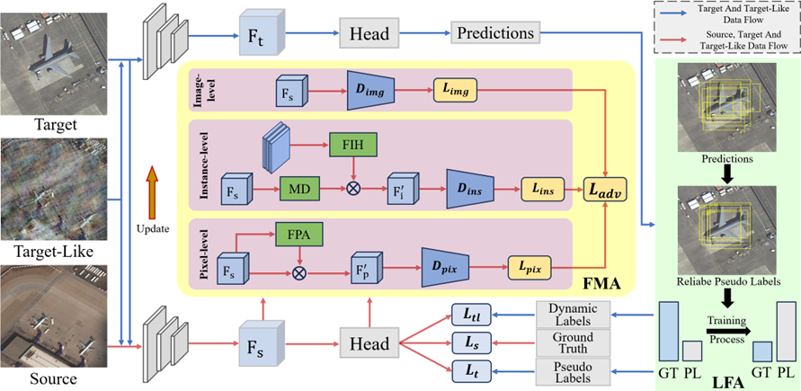

# FIE-Net
This repository provides an implement for our TGRS2025 paper "FIE-Net: Foreground Instance Enhancement Network for Domain Adaptation Object Detection in Remote Sensing Imagery" on Pytorch.



# Abstract
Domain adaptation methods can mitigate performance degradation in remote sensing image object detection that arises from inter-domain differences. However, current approaches often overlook the focused attention on foreground features, and the differences between foreground and background in remote sensing images implicitly diminishes the characteristics of the foreground. To address this challenge, we propose a foreground instance enhancement network (FIE-Net) to balance the differences between foreground and background in remote sensing images, while enhancing the alignment and application of foreground features. The FIE-Net cooperates the foreground-focused multi-granularity feature alignment (FMA) module with the label filtering and application (LFA) module, progressively focusing on the salient foreground features during the processes of feature alignment and label application. Specifically, FMA directs feature alignment towards the foreground focus during the multi-granularity feature alignment process, through foreground-focus perception attention and instance-centered emphasis approach. LFA balances the foreground and background difference information contained in labels, through the hybrid threshold label filtering method and the progressive label switching strategy. The experimental results indicate superior performance and generalization capabilities of our proposed FIE-Net in multiple remote sensing adaptation scenarios. Code is released at https://github.com/Lab-PANbin/.

# Get Started
## Environments
```
# Prepare environments via conda
conda create -n dense-teacher python=3.8.5
conda install pytorch==1.10.1 torchvision==0.11.2 torchaudio==0.10.1 cudatoolkit=11.3 -c pytorch -c conda-forge

# install cvpods
python3 -m pip install -e cvpods

# recommend wandb for visualizing the training
pip install wandb

pip install imgaug
```
## Dataset
All the data arrangements follow the format of PASCAL_VOC. The dataset files are in the folder of `cvpods/cvpods/data/datasets` and the config path are in `cvpods/cvpods/data/datasets/paths_route.py`. Please refers to [cvpods](https://github.com/Megvii-BaseDetection/cvpods).

We plan to release all the prepared data for convient reproduction. Please stay tuned.

## Pretrained Model
We use the VGG16 as the backbone, the pretrained model can be downloaded from this [link](https://drive.google.com/file/d/1Nb2sYh8GHiEUDtfUn5Buwugu6bNd1VbT/view?usp=sharing). Then the `MODEL.WEIGHTS` should be updated in `config.py` correspondingly.

## Training
```
CUDA_VISIBLE_DEVICES=0,1,2,3 pods_train --dir . --dist-url "tcp://127.0.0.1:29007" --num-gpus 4 OUTPUT_DIR 'outputs'
```
* If you want use `wandb`, specify wandb account in `runner.py` and then add `WANDB True` into the command.
* The model is trained on 4 RTX 3090 GPUs.

## Testing
```
CUDA_VISIBLE_DEVICES=0,1,2,3 pods_test --dir . --num-gpus 4 MODEL.WEIGHTS $model_path
```
Note that if you provide a relative model path, the `$model_path` is the relative path to `cvpods`. It is recommended to use the absolute path for loading the right model.
